# AI CRM

> Production-ready, AI-native Customer Relationship Management system built as a pnpm monorepo. Combines a React SPA, Express API, MongoDB persistence, Redis-backed job queues, and Anthropic Claude for intelligent lead scoring, sentiment analysis, and natural-language CRM querying.

[](https://github.com/your-org/ai-crm/actions/workflows/ci.yml)
[](https://www.typescriptlang.org/)
[](https://react.dev/)
[](https://expressjs.com/)
[](https://www.mongodb.com/)
[](https://redis.io/)
[](https://anthropic.com/)

---

## Table of Contents

- [System Architecture](#system-architecture)
- [Tech Stack](#tech-stack)
- [Monorepo Structure](#monorepo-structure)
- [Backend Architecture](#backend-architecture)
- [Data Model](#data-model)
- [Authentication Flow](#authentication-flow)
- [AI Engine](#ai-engine)
- [Frontend Architecture](#frontend-architecture)
- [Background Jobs & Scheduler](#background-jobs--scheduler)
- [CI/CD Pipeline](#cicd-pipeline)
- [Security Model](#security-model)
- [Quick Start](#quick-start)
- [Environment Variables](#environment-variables)

---

## System Architecture

The system is split into three deployable units: a static SPA served through nginx, a Node.js API server, and shared backing services (MongoDB + Redis).

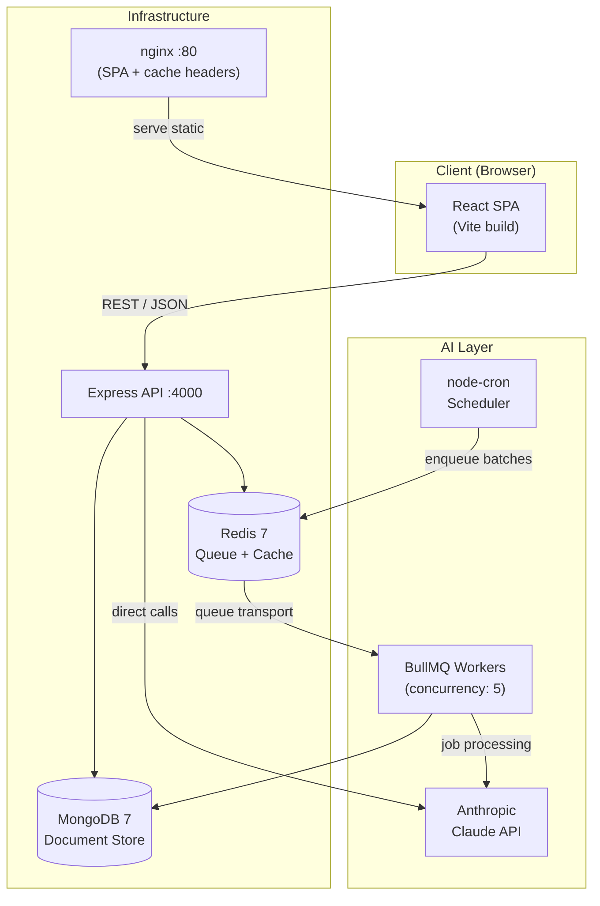

---

## Tech Stack

### Backend

| Layer         | Technology                             | Purpose                                           |
| ------------- | -------------------------------------- | ------------------------------------------------- |
| Runtime       | Node.js 20 LTS                         | JavaScript runtime                                |
| Framework     | Express 4.21                           | HTTP server, routing, middleware chain            |
| Database      | MongoDB 7 + Mongoose 8                 | Document persistence, aggregation pipelines       |
| Cache / Queue | Redis 7 + BullMQ 5                     | Async job queues, rate-limit counters             |
| AI Provider   | Anthropic Claude (`claude-sonnet-4-6`) | Scoring, sentiment, follow-up, chat               |
| Auth          | JWT (jsonwebtoken) + bcryptjs          | Stateless access tokens + refresh token rotation  |
| Validation    | Zod 3 (shared with client)             | Request parsing, AI response validation           |
| Logging       | Pino 9 + pino-http                     | Structured JSON logs                              |
| Scheduling    | node-cron 4                            | Nightly batch scoring (02:00 UTC)                 |
| Config        | envalid                                | Typed, validated environment variables at startup |

### Frontend

| Layer         | Technology                 | Purpose                                         |
| ------------- | -------------------------- | ----------------------------------------------- |
| Framework     | React 18.3                 | UI rendering                                    |
| Build         | Vite 5                     | Dev server, bundling, HMR                       |
| Routing       | React Router v6            | Client-side navigation, protected routes        |
| Server state  | TanStack Query 5           | Data fetching, caching, mutation + invalidation |
| Forms         | React Hook Form 7 + Zod    | Validated, uncontrolled forms                   |
| Drag & Drop   | dnd-kit                    | Pipeline Kanban board                           |
| Charts        | Recharts 3                 | Analytics dashboards                            |
| Styling       | Tailwind CSS 3             | Utility-first CSS                               |
| UI Primitives | Radix UI                   | Accessible, unstyled headless components        |
| i18n          | i18next 23                 | EN / PL translations                            |
| Testing       | Vitest 2 + Testing Library | Unit + component tests                          |
| Components    | Storybook 8                | Visual documentation + isolated development     |

### Infrastructure & Tooling

| Tool                  | Purpose                                         |
| --------------------- | ----------------------------------------------- |
| pnpm 9 workspaces     | Monorepo dependency management                  |
| Turborepo 2           | Task orchestration, build graph, local cache    |
| Docker / Compose      | Local dev environment + production images       |
| GitHub Actions        | CI (lint → test → build) + CD (GHCR push)       |
| Husky 9 + lint-staged | Git hooks — format on commit, typecheck on push |
| Commitlint            | Conventional Commits enforcement                |
| Prettier 3            | Consistent code formatting                      |

---

## Monorepo Structure

```
ai-crm/
├── packages/
│   ├── shared/                  # @ai-crm/shared
│   │   └── src/
│   │       ├── schemas/         # Zod schemas: auth, contact, deal, ai (source of truth)
│   │       └── types/           # api.types.ts (ApiResponse, PaginatedResponse), enums
│   │
│   ├── server/                  # @ai-crm/server
│   │   └── src/
│   │       ├── app.ts           # DI wiring + Express app factory (createApp)
│   │       ├── server.ts        # Entry point: connectDB → createApp → listen
│   │       ├── modules/         # auth | contacts | deals | activities | analytics
│   │       ├── ai/              # AiClient, providers, services, prompts, AiUsageTracker
│   │       ├── jobs/            # BullMQ queues, workers, node-cron scheduler
│   │       ├── config/          # env.ts, database.ts, redis.ts
│   │       └── shared/          # errors, middleware, utils
│   │
│   └── client/                  # @ai-crm/client
│       └── src/
│           ├── app/             # App.tsx, providers.tsx, router.tsx
│           ├── features/        # auth | contacts | pipeline | ai | ai-chat | analytics | activities | settings
│           └── shared/          # components/ui, components/layout, hooks, i18n, lib/axios, lib/queryClient
│
├── .github/
│   ├── workflows/               # ci.yml, cd.yml
│   ├── ISSUE_TEMPLATE/          # bug_report.yml, feature_request.yml
│   ├── PULL_REQUEST_TEMPLATE.md
│   ├── CODEOWNERS
│   └── dependabot.yml
│
├── turbo.json                   # Task pipeline: build → lint/test
├── pnpm-workspace.yaml
└── docker-compose.yml
```

**Turborepo task graph** — `shared:build` must complete before any downstream lint or test:

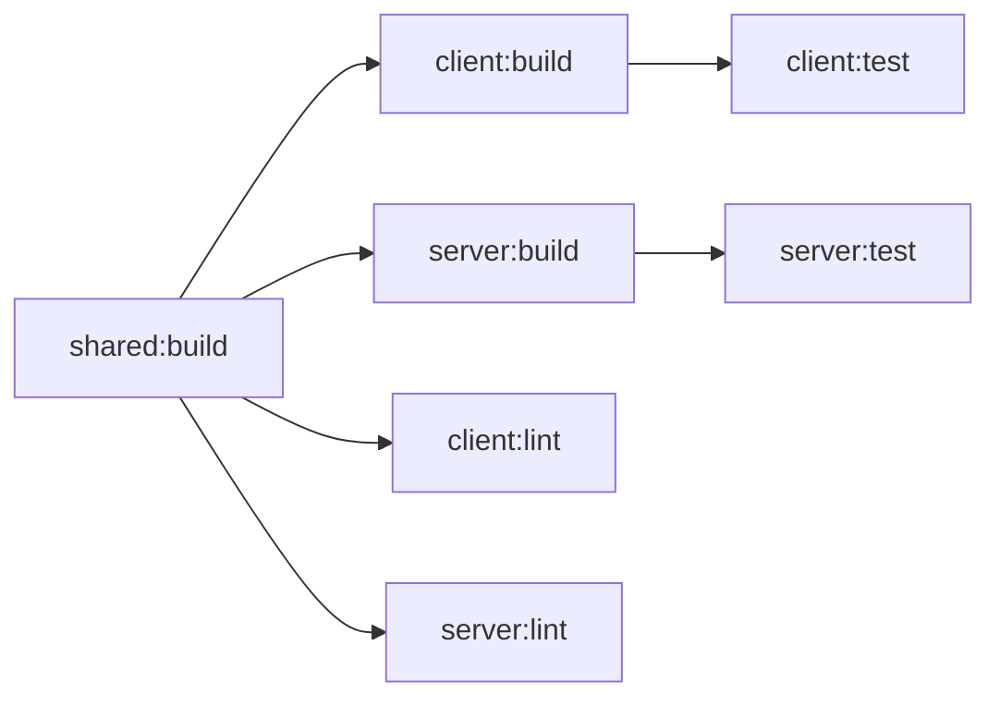

---

## Backend Architecture

### Layered Architecture

Every domain module follows the same four-layer contract. Layers only call downward — no skipping allowed.

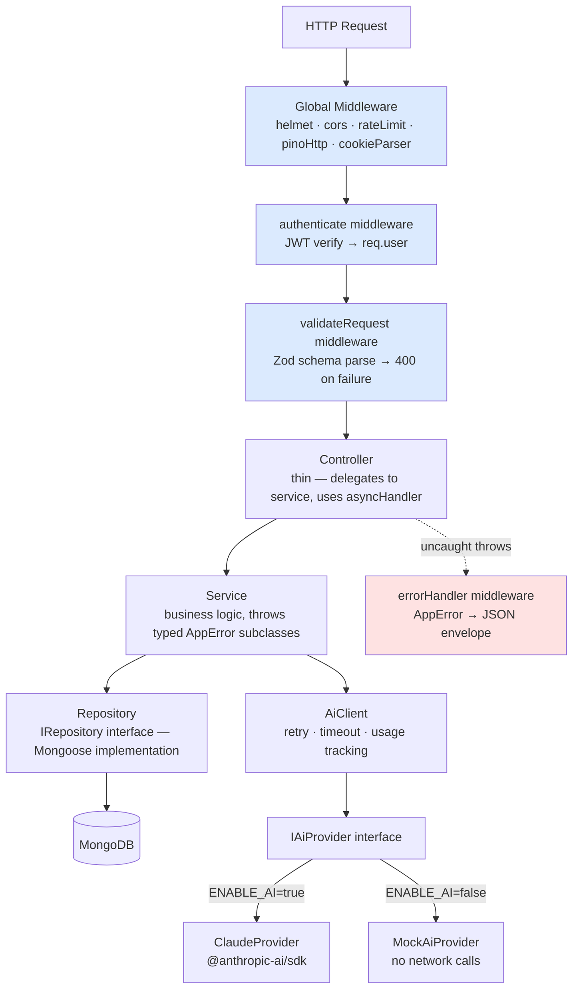

### Dependency Injection

All wiring happens **once**, explicitly in `src/app.ts`. No IoC container, no decorators, no magic. Repositories are constructed, injected into services, services into controllers, controllers into route factories:

```typescript
// app.ts — illustrative excerpt
const contactRepository = new MongoContactRepository();
const activityRepository = new MongoActivityRepository();
const aiClient = new AiClient(aiProvider, usageTracker, env.ENABLE_AI);
const scoringService = new ContactScoringService(contactRepository, activityRepository, aiClient);
const contactController = new ContactController(
  contactService,
  scoringService,
  followUpService,
  sentimentService,
);
```

Consequences: test isolation is trivial (inject mock repositories), swapping a data store only requires a new class implementing the `IRepository` interface.

### API Response Envelope

All endpoints return the same shape:

```
// Success (single or paginated)
{ "success": true,  "data": T, "meta"?: { page, limit, total, totalPages } }

// Error
{ "success": false, "message": string, "errors"?: ZodIssue[] }
```

### Route Map

| Method + Path                                        | Module                                         |
| ---------------------------------------------------- | ---------------------------------------------- |
| `POST /api/auth/register · login · refresh · logout` | Auth                                           |
| `GET · POST /api/contacts`                           | Contacts — list (filtered, paginated) + create |
| `GET · PUT · DELETE /api/contacts/:id`               | Contacts — detail, update, soft-delete         |
| `PATCH /api/contacts/bulk-status`                    | Contacts — bulk status update                  |
| `GET · POST /api/contacts/:id/activities`            | Activities scoped to contact                   |
| `GET · POST · PUT · DELETE /api/deals`               | Deals CRUD                                     |
| `GET · POST /api/deals/:id/activities`               | Activities scoped to deal                      |
| `GET /api/activities`                                | Global activity feed                           |
| `GET /api/analytics`                                 | Dashboard KPIs + chart data                    |
| `POST /api/ai/score/:contactId`                      | AI — single contact scoring                    |
| `POST /api/ai/score/bulk`                            | AI — enqueue batch scoring job                 |
| `GET /api/ai/score-history/:contactId`               | AI — scoring history                           |
| `POST /api/ai/follow-up/:contactId`                  | AI — generate follow-up suggestions            |
| `POST /api/ai/sentiment/:contactId`                  | AI — trigger sentiment analysis                |
| `POST /api/ai/chat`                                  | AI — natural-language CRM query                |
| `GET /api/ai/usage`                                  | AI — token usage + cost dashboard              |

---

## Data Model

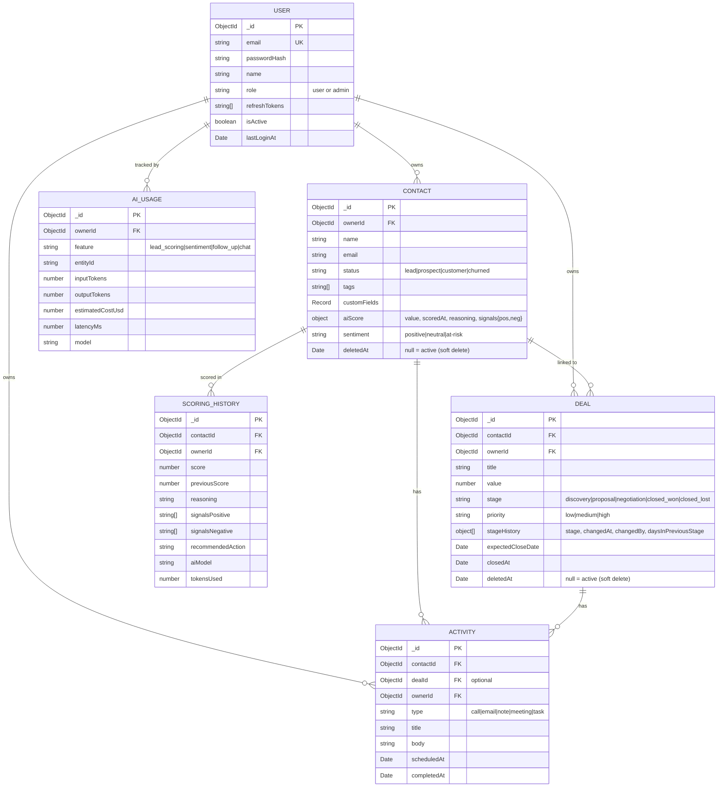

**Key schema decisions:**

- **Soft delete** (`deletedAt: Date | null`) on `Contact` and `Deal`. Mongoose `pre('find')` middleware auto-injects `{ deletedAt: null }` on every query — callers never need to remember to filter.
- **Embedded `aiScore` in Contact** avoids a join on the most common read path. Full audit trail lives in `SCORING_HISTORY`.
- **`stageHistory` array in Deal** tracks every stage transition with `daysInPreviousStage` — enables pipeline velocity analytics without extra collections or external event sourcing.
- **`ownerId` on every document** — all repository methods require it. No query ever returns data across owners.
- **Text index** on Contact (`name`, `email`, `company`) powers full-text search without Elasticsearch.
- **`password` and `refreshTokens` fields** are `select: false` in Mongoose — never returned in queries unless explicitly requested with `+password`.

---

## Authentication Flow

JWT dual-token strategy: short-lived access tokens + long-lived refresh tokens stored in HTTP-only cookies, rotated on every use.

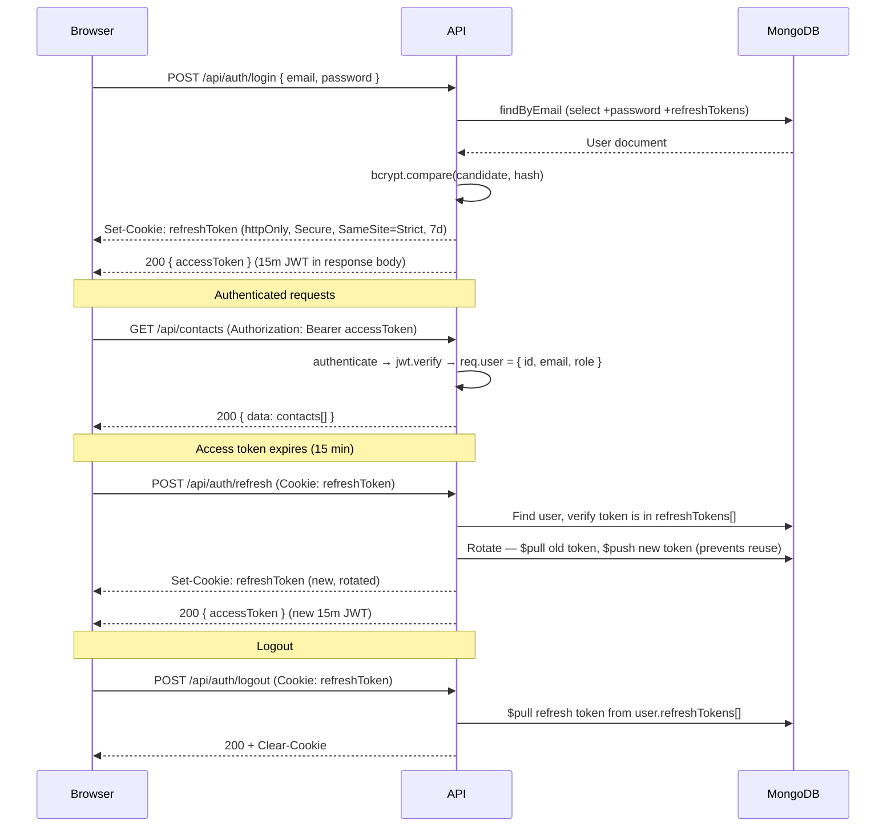

---

## AI Engine

### Infrastructure Architecture

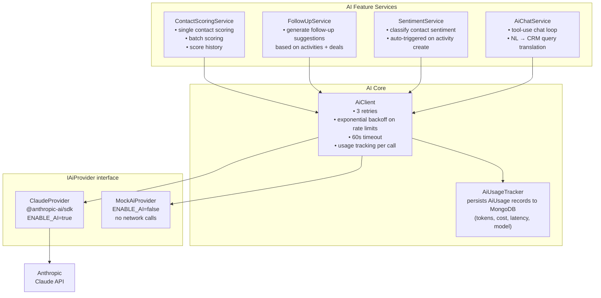

`AiClient` is the **only** code that touches a provider. All retry, timeout, and usage-tracking logic lives there. Feature services call `aiClient.complete()` and receive a typed `AiCompletionResponse`. Swapping to a different LLM requires only implementing `IAiProvider`.

### Lead Scoring Pipeline

Scoring runs in two modes — **on-demand** via REST and **background batch** via BullMQ + nightly cron.

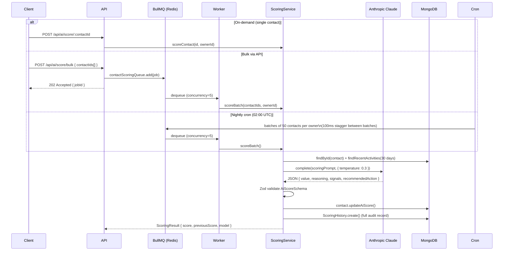

### AI Chat — Tool-Use Pattern

The chat feature implements a **two-round-trip tool-use loop**. Claude decides which CRM tool to call, the server executes the query against MongoDB, then Claude synthesizes a natural-language response:

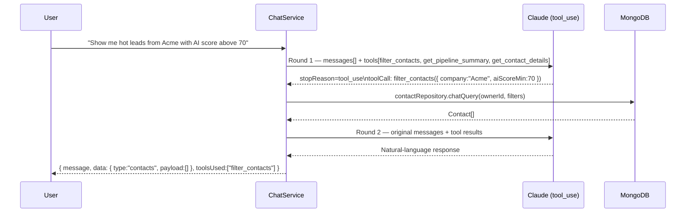

Available tools: `filter_contacts` (status, search, AI score range, sentiment, company, date), `get_pipeline_summary` (stage breakdown + revenue), `get_contact_details` (lookup by name or email).

### Sentiment Auto-Trigger — Observer Pattern

Sentiment analysis fires automatically on every new activity via setter injection:

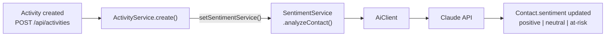

This avoids a circular module dependency while keeping the trigger transparent to callers.

---

## Frontend Architecture

### Application Shell

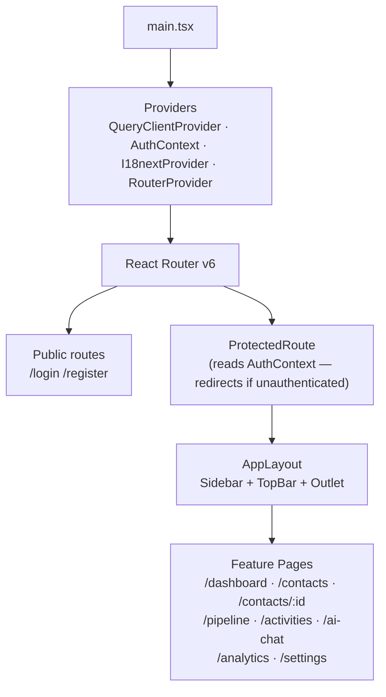

### State Management Strategy

| State type   | Solution                  | Rationale                                                      |
| ------------ | ------------------------- | -------------------------------------------------------------- |
| Auth session | React Context + Reducer   | Global, synchronous, no network needed                         |
| Server data  | TanStack Query 5          | Stale-while-revalidate, background refetch, cache invalidation |
| Form state   | React Hook Form           | Uncontrolled, minimal re-renders, Zod resolver                 |
| UI / local   | `useState` / `useReducer` | Component-local, not shared upward                             |

No Redux or Zustand. Server state (TanStack Query) covers the vast majority of shared state in a data-centric app like a CRM.

### Feature Module Pattern

Every domain follows the same layout under `src/features/<domain>/`:

```
features/pipeline/
├── api/
│   └── pipeline.api.ts       # typed axios wrappers, imports from @ai-crm/shared
├── hooks/
│   ├── usePipeline.ts        # useQuery — deals grouped by stage
│   └── useDealMutations.ts   # useMutation — create / update / move / delete
├── components/
│   ├── PipelineBoard.tsx     # dnd-kit DndContext, columns layout
│   ├── PipelineColumn.tsx    # Droppable zone per stage
│   ├── DealCard.tsx          # Draggable deal card
│   ├── DealForm.tsx          # react-hook-form + zod validation
│   ├── PipelineSummary.tsx   # KPI bar (total value, deal count per stage)
│   └── DealCard.stories.tsx  # Storybook stories co-located with component
└── pages/
    └── PipelinePage.tsx      # Assembles the full page, wires hooks → components
```

### Data Fetching Pattern

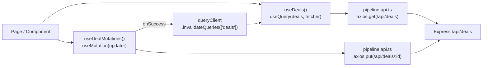

The axios instance (`src/shared/lib/axios.ts`) handles:

- Attaching `Authorization: Bearer <token>` on every request
- Automatic silent refresh on 401 via response interceptor
- Base URL from `VITE_API_URL` environment variable

---

## Background Jobs & Scheduler

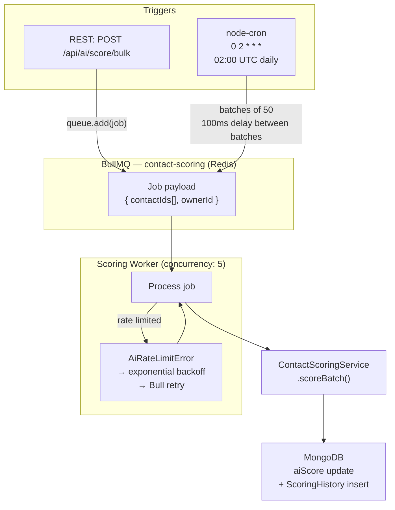

The scheduler fans out all contacts across all users into 50-contact batches with staggered enqueue delays. This prevents a thundering-herd against the Claude API at 02:00 UTC.

---

## CI/CD Pipeline

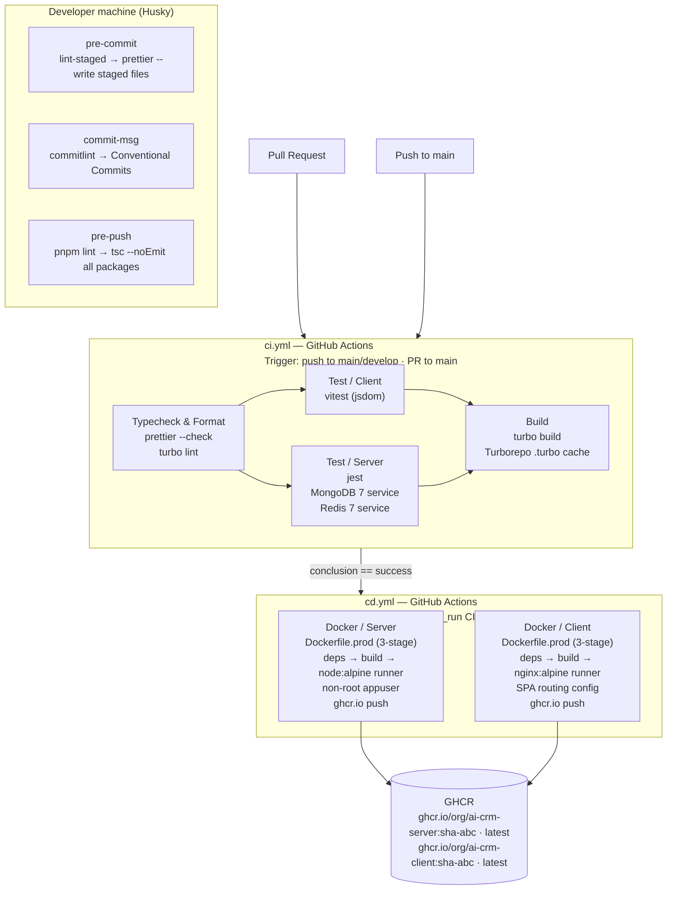

**Image tagging strategy:** `sha-<short>` (immutable, safe to pin in deployments) + `latest` (rolling pointer for environments that track HEAD).

**Concurrency:** CI cancels in-progress runs on the same branch (fast feedback on rapid pushes). CD never cancels (`cancel-in-progress: false`) — a deploy must always finish.

---

## Security Model

| Concern          | Approach                                                                                                             |
| ---------------- | -------------------------------------------------------------------------------------------------------------------- |
| Authentication   | JWT access tokens (15m) + httpOnly refresh tokens (7d), rotated on every use — stolen refresh token cannot be reused |
| Password storage | bcrypt cost factor 12; password field excluded from all Mongoose queries by default (`select: false`)                |
| Data isolation   | `ownerId` required on every repository method — data never crosses user boundaries                                   |
| Input validation | Zod schemas parsed at the request boundary (`validateRequest` middleware) before business logic runs                 |
| Rate limiting    | `express-rate-limit`: global limiter + stricter limit on `/api/auth/*`                                               |
| HTTP headers     | Helmet (CSP, HSTS, X-Frame-Options, X-Content-Type-Options, Referrer-Policy)                                         |
| CORS             | Locked to `CLIENT_URL` env var, credentials mode enabled                                                             |
| Container        | Non-root `appuser` created in server production image                                                                |
| AI toggle        | `ENABLE_AI=false` → `MockAiProvider` — Claude API is never called without explicit opt-in; API key is optional       |
| Secrets          | `JWT_SECRET` and `ANTHROPIC_API_KEY` validated at startup by `envalid` — process exits fast if misconfigured         |

---

## Quick Start

**Prerequisites:** Docker + Docker Compose (for the simplest path). Node.js 20 + pnpm 9 for local development without Docker.

### Docker

```bash
git clone <repo-url> && cd ai-crm
cp .env.example .env      # set JWT_SECRET (min 32 chars) at minimum
docker compose up
```

| Service     | URL                              |
| ----------- | -------------------------------- |
| React SPA   | http://localhost:5173            |
| Express API | http://localhost:4000/api/health |
| Storybook   | http://localhost:6006            |
| MongoDB     | `mongodb://localhost:27017`      |
| Redis       | `redis://localhost:6379`         |

### Local (without Docker)

```bash
pnpm install      # installs all workspaces + initializes Husky hooks
pnpm dev          # starts client (:5173) + server (:4000) + shared watcher
```

### Commands

```bash
# Root — runs across all packages via Turborepo
pnpm build              # full build (shared → server + client)
pnpm test               # all tests
pnpm lint               # typecheck all packages
pnpm format             # prettier --write .
pnpm format:check       # prettier --check . (used in CI)

# Per-package
pnpm --filter @ai-crm/client test         # vitest (single run)
pnpm --filter @ai-crm/client test:watch   # vitest watch
pnpm --filter @ai-crm/client storybook    # Storybook :6006
pnpm --filter @ai-crm/server test         # jest (unit + integration)
```

### Adding a New Domain Module

1. **`packages/shared`** — add Zod schema in `src/schemas/`, export from `src/schemas/index.ts`
2. **`packages/server/src/modules/<domain>/`** — create `model.ts → repository.ts → service.ts → controller.ts → routes.ts`, wire in `app.ts`
3. **`packages/client/src/features/<domain>/`** — create `api/<domain>.api.ts`, `hooks/`, `components/`, `pages/`
4. Register the page in `src/app/router.tsx` and the nav entry in `Sidebar.tsx`

---

## Environment Variables

| Variable              | Required | Default                 | Description                                      |
| --------------------- | -------- | ----------------------- | ------------------------------------------------ |
| `NODE_ENV`            | Yes      | —                       | `development` / `test` / `production`            |
| `PORT`                | No       | `4000`                  | Express listen port                              |
| `MONGODB_URI`         | Yes      | —                       | MongoDB connection string                        |
| `MONGODB_URI_TEST`    | No       | `''`                    | Test database URI (jest integration tests)       |
| `REDIS_URL`           | Yes      | —                       | Redis connection string (BullMQ + rate limiting) |
| `JWT_SECRET`          | Yes      | —                       | JWT signing secret — minimum 32 characters       |
| `JWT_ACCESS_EXPIRES`  | No       | `15m`                   | Access token lifetime                            |
| `JWT_REFRESH_EXPIRES` | No       | `7d`                    | Refresh token lifetime                           |
| `CLIENT_URL`          | No       | `http://localhost:5173` | Allowed CORS origin                              |
| `ENABLE_AI`           | No       | `false`                 | Set `true` to enable Claude API calls            |
| `ANTHROPIC_API_KEY`   | If AI    | —                       | Anthropic API key                                |
| `AI_MODEL`            | No       | `claude-sonnet-4-6`     | Claude model identifier                          |
| `AI_MAX_TOKENS`       | No       | `1024`                  | Max tokens per AI completion                     |
